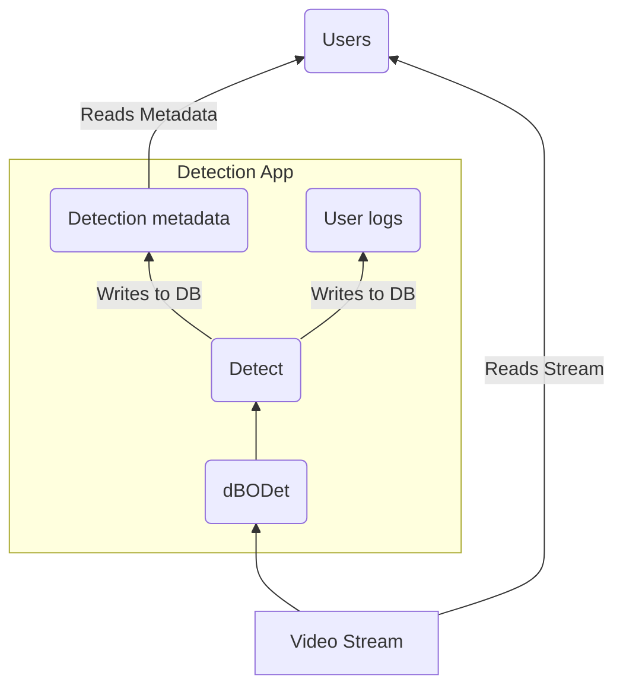

# DL_HW3

```mermaid
graph BT
A[Video Stream] -->B(dBODet)
subgraph Detection App
B --> C(Detect) 
C -->|Writes to DB| D(Detection metadata)
C -->|Writes to DB| E(User logs)
end
D-->|Reads Metadata| F(Users)
A-->|Reads Stream| F
```
